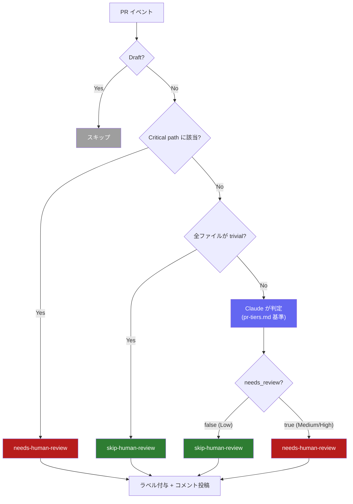

# PR Review Judge

PRごとに「人間レビューが必要かどうか」を自動判定する GitHub Actions ワークフロー。

## フロー図

### 判定ゲートの優先順位

1. **Static deny** — critical path glob に該当 → 即 `needs-human-review`
2. **Static allow** — 全ファイルが trivial path glob に該当 → 即 `skip-human-review`
3. **Dynamic judge** — Claude (Haiku 4.5) が pr-tiers.md を基準に判定

### パス設定

| ゲート | 現在のパターン |
|---|---|
| Critical (deny) | `.github/workflows/**` |
| Trivial (allow) | `**/*.md`, `public/**`, `.gitignore` |

## 判定基準 (pr-tiers.md)

| レベル | needs_review | 対象 |
|--------|:---:|------|
| **Low** | `false` | コメント・タイポ修正、constants.ts の軽微修正、テストのみ |
| **Medium** | `true` | components のロジック変更、Server Action 追加、UI 変更、utils 変更 |
| **High** | `true` | 認証・DB・インフラ、依存関係更新、30行超のロジック変更 |

> 複数レベルにまたがる場合は高い方を採用。迷ったら `needs_review: true`。

## ファイル構成

| ファイル | 役割 |
|---|---|
| `dynamic-judge.md` | Claude へのプロンプト |
| `pr-tiers.md` | 判定基準 (Low / Medium / High) |
| `post-review-status.sh` | ラベル・コメント投稿スクリプト |

## 設定の変更方法

| やりたいこと | 編集先 |
|---|---|
| critical path の追加 | `workflows/pr-review-judge.yml` → static-deny の `filters.critical` |
| trivial path の追加 | `workflows/pr-review-judge.yml` → static-allow の `filters.trivial` |
| Claude の判定基準変更 | `pr-tiers.md` |
| Claude へのプロンプト変更 | `dynamic-judge.md` |
| コメント・ラベルの出力変更 | `post-review-status.sh` |
