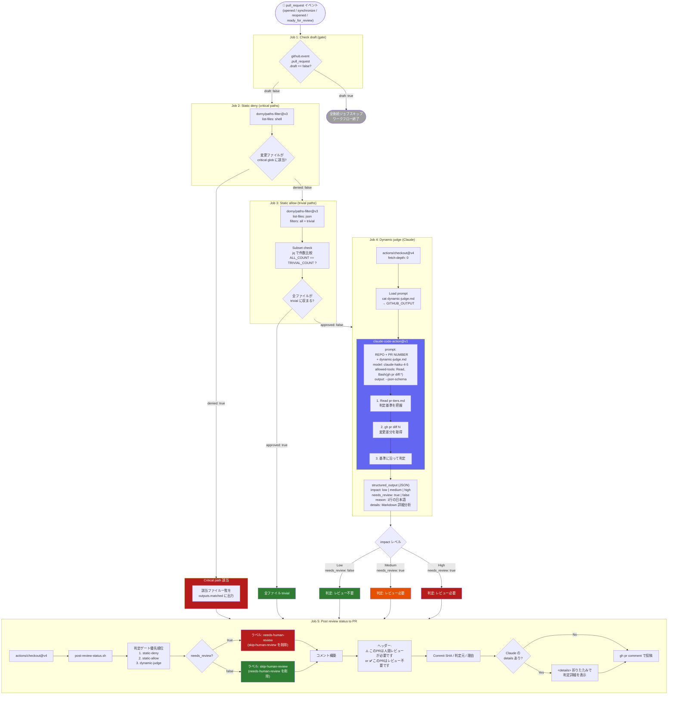

# PR Review Judge ワークフロー

## フロー図



## 判定基準 (pr-tiers.md)

| レベル | needs_review | 対象 |
|--------|:---:|------|
| **Low** | `false` | コメント・タイポ修正、constants.ts の軽微な日本語ラベル修正、テストファイルのみ |
| **Medium** | `true` | components のロジック変更、Server Action 追加、Tailwind UI 変更、utils 関数変更 |
| **High** | `true` | 認証・DB・インフラ、依存関係更新、30行超のロジック変更、環境変数関連 |

> 複数レベルにまたがる場合は常に高い方を採用。迷ったら `needs_review: true`。

## ファイル構成

```
.github/
├── pr-review-judge/
│   ├── dynamic-judge.md       # Claude へのプロンプト
│   ├── pr-tiers.md            # 判定基準 (Low / Medium / High)
│   ├── post-review-status.sh  # ラベル・コメント投稿スクリプト
│   └── diagram.md             # このファイル
└── workflows/
    └── pr-review-judge.yml    # ワークフロー本体
```

## パス設定の変更方法

| 変更したいこと | 編集先 |
|---|---|
| critical path の追加 | `pr-review-judge.yml` → static-deny の `filters.critical` |
| trivial path の追加 | `pr-review-judge.yml` → static-allow の `filters.trivial` |
| Claude の判定基準変更 | `pr-review-judge/pr-tiers.md` |
| Claude へのプロンプト変更 | `pr-review-judge/dynamic-judge.md` |
| コメント・ラベルの出力変更 | `pr-review-judge/post-review-status.sh` |
